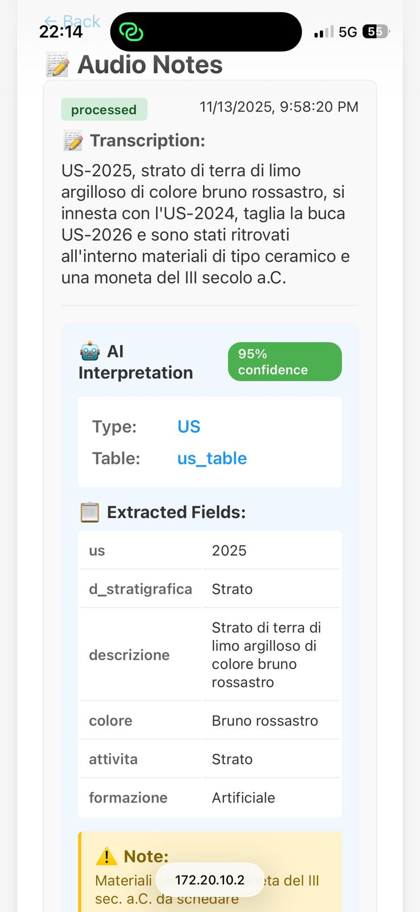
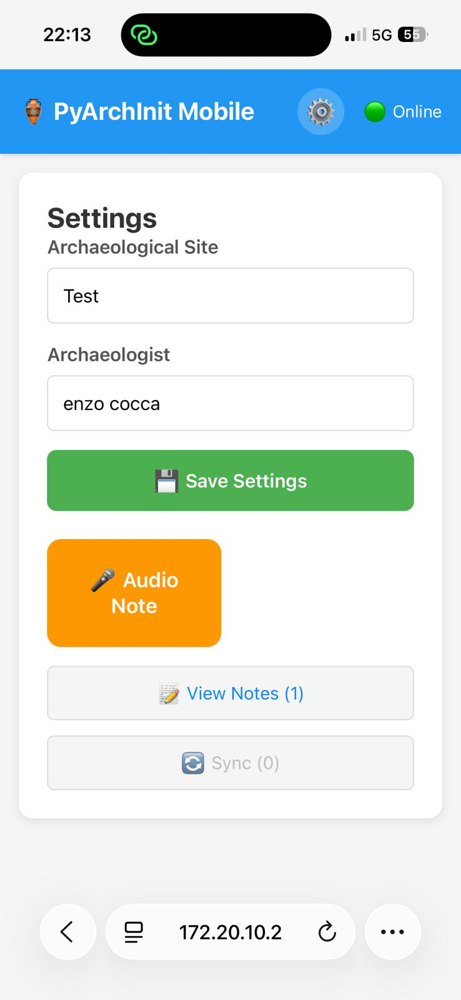
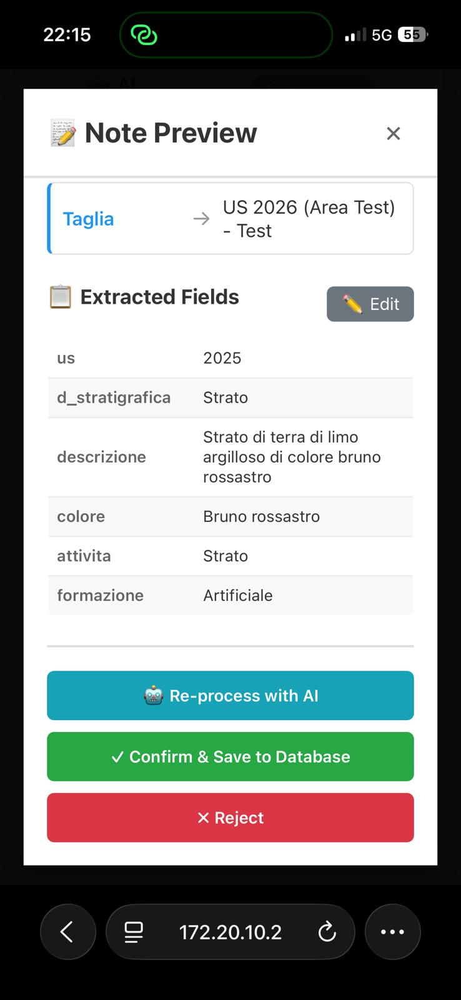
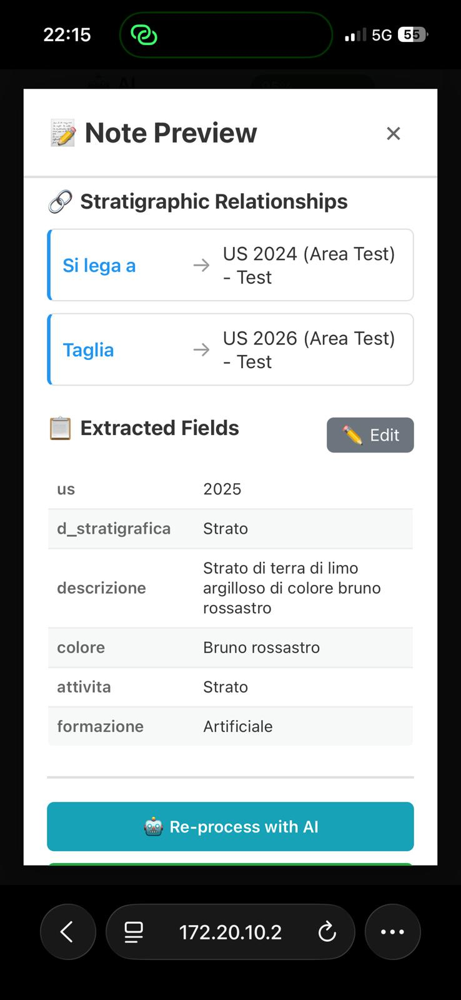

<p align="center">
  
</p>

# pyArchInit Mobile PWA

> Offline-first Progressive Web Application for archaeological field documentation with AI-powered audio transcription and intelligent data extraction

[](https://www.gnu.org/licenses/gpl-3.0)
[](https://www.python.org/downloads/)
[](https://nodejs.org/)
[](https://reactjs.org/)
[](https://fastapi.tiangolo.com/)

## 📱 Overview

pyArchInit Mobile PWA provides archaeologists with a modern mobile interface for field documentation, seamlessly integrating with the existing [pyArchInit](https://pypi.org/project/pyarchinit/) QGIS plugin ecosystem. Record voice notes, capture photos, and leverage AI to automatically structure your archaeological data - all while working offline in remote excavation sites.

### Key Features

**🎤 AI-Powered Audio Notes**
- Voice recording with pause/resume support
- Automatic transcription using OpenAI Whisper
- Intelligent archaeological data extraction with Claude AI
- Structured field mapping to pyArchInit database schema
- Multilanguage support (Italian, English, and more)
- Validation and editing before database insertion

**📸 Smart Photo Management**
- Native camera capture or gallery upload
- Automatic image processing (thumbnail 150x150, resize 800x600, original)
- EXIF metadata extraction (GPS, date, camera model)
- Entity-based organization (US, Tomba, Material)
- Direct integration with pyArchInit media_table

**⚡ Offline-First Architecture**
- Full functionality without internet connection
- IndexedDB local storage with sync queue
- Automatic background synchronization when online
- Conflict resolution and retry logic

**🔄 pyArchInit Integration**
- Compatible with existing pyArchInit PostgreSQL database
- Supports stratigraphic units (US), tombs, material inventory
- List-of-lists format for relationships and included materials
- Duplicate detection with merge/overwrite options

## 🚀 Quick Start

### Automated Setup

```bash
# Clone the repository
git clone https://github.com/enzococca/pyarchinit-mobile-pwa.git
cd pyarchinit-mobile-pwa

# Run setup script
chmod +x setup.sh
./setup.sh
```

The setup script will:
1. Create Python virtual environment
2. Install backend dependencies
3. Install frontend dependencies
4. Create media directories
5. Guide you through .env configuration

### Manual Installation

#### Prerequisites
- Python 3.8 or higher
- Node.js 16 or higher
- PostgreSQL 12+ (or SQLite for development)

#### Backend Setup

```bash
cd backend

# Create virtual environment
python3 -m venv venv
source venv/bin/activate  # On Windows: venv\Scripts\activate

# Install dependencies
pip install -r requirements.txt

# Configure environment
cp ../.env.example ../.env
# Edit .env with your database credentials and API keys
```

#### Frontend Setup

```bash
cd frontend

# Install dependencies
npm install

# Configure API endpoint (if different from default)
echo "VITE_API_URL=http://localhost:8000" > .env
```

## ⚙️ Configuration

### Environment Variables

Copy `.env.example` to `.env` and configure:

```bash
# Database (PostgreSQL)
PYARCHINIT_DB_HOST=localhost
PYARCHINIT_DB_PORT=5432
PYARCHINIT_DB_NAME=pyarchinit_db
PYARCHINIT_DB_USER=postgres
PYARCHINIT_DB_PASSWORD=your_password

# Or use SQLite for development
USE_SQLITE=true
SQLITE_DB_PATH=./backend/pyarchinit_db.sqlite

# AI Services (Required)
OPENAI_API_KEY=sk-proj-your-key-here
ANTHROPIC_API_KEY=sk-ant-api03-your-key-here

# Media storage
PYARCHINIT_MEDIA_ROOT=/path/to/media
```

### API Keys

Get your API keys from:
- **OpenAI (Whisper)**: https://platform.openai.com/api-keys
- **Anthropic (Claude)**: https://console.anthropic.com/

## 💻 Development

### Running Locally

**Terminal 1 - Backend:**
```bash
cd backend
source venv/bin/activate
python main.py
# Server running at http://localhost:8000
```

**Terminal 2 - Frontend:**
```bash
cd frontend
npm run dev
# PWA running at http://localhost:5173
```

### Testing on Mobile Devices

To test on physical devices connected to the same network:

```bash
# Backend (allow external connections)
cd backend
python main.py --host 0.0.0.0

# Frontend (allow external connections)
cd frontend
npm run dev -- --host

# Access from mobile: http://<your-computer-ip>:5173
```

For HTTPS (required for camera/microphone on iOS):
```bash
# Use ngrok or similar
ngrok http 5173
```

## 📊 Architecture

### Tech Stack

**Frontend:**
- React 18 with Hooks
- Vite for build tooling
- IndexedDB (idb) for offline storage
- Web Audio API for recording
- MediaDevices API for camera

**Backend:**
- FastAPI (Python)
- SQLAlchemy ORM
- PostgreSQL / SQLite
- Pillow for image processing
- OpenAI Whisper API
- Anthropic Claude API

### Data Flow

```
Mobile Device (Offline/Online)
  ↓
PWA Frontend (React)
  ├─ AudioRecorder → IndexedDB
  ├─ PhotoCapture → IndexedDB
  └─ SyncService → (when online) → Backend API
       ↓
Backend (FastAPI)
  ├─ ImageProcessor → thumb/resize/original
  ├─ Whisper → audio transcription
  └─ Claude → structured data extraction
       ↓
PostgreSQL (PyArchInit)
  ├─ site_table
  ├─ us_table
  ├─ media_table
  └─ mobile_notes
```

### Key Components

**Frontend (`frontend/src/`):**
- `components/AudioRecorder.jsx` - Voice recording with pause/resume
- `components/PhotoCapture.jsx` - Camera access and gallery upload
- `components/NotePreview.jsx` - AI interpretation preview and validation
- `components/RapportiEditor.jsx` - Stratigraphic relationships editor
- `services/offlineStorage.js` - IndexedDB abstraction layer
- `services/syncService.js` - Background synchronization

**Backend (`backend/`):**
- `main.py` - FastAPI application and routes
- `services/image_processor.py` - Image resizing and EXIF extraction
- `services/ai_processor.py` - Whisper + Claude integration
- `models/database.py` - SQLAlchemy models for PyArchInit schema

## 📱 Usage

### Installing the PWA

**iOS (Safari):**
1. Open the app in Safari
2. Tap Share button
3. Select "Add to Home Screen"

**Android (Chrome):**
1. Open the app in Chrome
2. Tap menu (⋮)
3. Select "Install app"

### Recording Audio Notes

1. Select your archaeological site
2. Tap "Record" button
3. Describe the stratigraphic unit vocally (e.g., "US 2045, area 1, site test2, brown clay layer with tile inclusions")
4. Review the transcription
5. Validate AI-extracted data (US number, description, interpretation, relationships)
6. Edit if necessary
7. Confirm to save to database

### Managing Photos

1. Select entity type (US, Tomb, Material)
2. Enter entity details (site, area, US number)
3. Capture photo or upload from gallery
4. Add description and tags
5. Save - images are automatically processed into 3 versions

### Offline Operation

All data is stored locally in IndexedDB when offline. When connection is restored:
1. Sync queue automatically processes pending items
2. Progress is shown in the sync status indicator
3. Conflicts are handled with user confirmation

## 🤖 AI Processing

### Audio Transcription (Whisper)

- Supports 99+ languages with automatic detection
- Processes audio files up to 25MB
- Returns transcription with language code and confidence

### Archaeological Data Extraction (Claude)

Claude AI interprets the transcription and extracts:
- Entity type (US, TOMBA, MATERIALE)
- Numeric identifiers (us, area, sito)
- Descriptions and interpretations
- Stratigraphic relationships in list-of-lists format
- Inclusions and samples as nested arrays
- Controlled vocabulary terms

Example:
```
Input: "US 2045, area 1, site test2, brown clay layer with tile inclusions, covers US 2046"

Output:
{
  "entity_type": "US",
  "extracted_fields": {
    "us": 2045,
    "area": "1",
    "sito": "test2",
    "d_stratigrafica": "Strato",
    "descrizione": "Brown clay layer",
    "colore": "Brown",
    "inclusi": [["Tiles"]],
    "formazione": "Artificial"
  },
  "relationships": [["Copre", "2046", "1", "test2"]],
  "confidence": 0.95
}
```

## 📸 Screenshots

### Audio Notes & AI Processing

<p align="center">
  
  
  
</p>

*Left to right: Audio transcription with 95% AI confidence | Complete note preview with transcription & interpretation | Settings page*

### Note Preview & Data Extraction

<p align="center">
  
  
</p>

*Left to right: Extracted archaeological fields with edit option | Stratigraphic relationships editor (Si lega a, Taglia)*

## 🚀 Production Deployment

For detailed production deployment instructions, see **[DEPLOYMENT.md](DEPLOYMENT.md)**.

The deployment guide covers:
- **VPS deployment with Docker** (recommended)
- **Nginx reverse proxy** with SSL/HTTPS
- **Database setup** (PostgreSQL)
- **Media storage** configuration (local or S3)
- **Security hardening** (firewall, rate limiting, Fail2ban)
- **Monitoring and logging** setup
- **Backup strategies** for database and media files
- **Cost estimation** for different deployment sizes

Quick production deployment with Docker:
```bash
# See DEPLOYMENT.md for full instructions and configuration
docker-compose -f docker-compose.prod.yml up -d --build
```

## 🐳 Docker Development

```bash
# Build and run with Docker Compose (development)
docker-compose up -d

# Services:
# - Backend: http://localhost:8000
# - Frontend: http://localhost:5173
# - PostgreSQL: localhost:5432
```

## 🔐 Security

- HTTPS required for PWA features (camera, microphone)
- API key authentication for AI services
- Input validation and SQL injection prevention
- CORS configuration for trusted origins
- Secure password hashing (if auth is enabled)

## 🤝 Contributing

Contributions are welcome! Please:

1. Fork the repository
2. Create a feature branch (`git checkout -b feature/amazing-feature`)
3. Commit your changes (`git commit -m 'Add amazing feature'`)
4. Push to the branch (`git push origin feature/amazing-feature`)
5. Open a Pull Request

## 📝 License

This project is licensed under the GNU General Public License v3.0 - see the [LICENSE](LICENSE) file for details.

Compatible with PyArchInit's GPL-3.0 license.

## 🙏 Acknowledgments

- [PyArchInit](https://pypi.org/project/pyarchinit/) - Archaeological GIS integration for QGIS
- [OpenAI Whisper](https://openai.com/research/whisper) - Speech recognition
- [Anthropic Claude](https://www.anthropic.com/) - AI language model
- Archaeological community for feedback and testing

## 📧 Contact

- **Repository**: https://github.com/enzococca/pyarchinit-mobile-pwa
- **Issues**: https://github.com/enzococca/pyarchinit-mobile-pwa/issues
- **PyArchInit**: https://pyarchinit.org

---

**Built with ❤️ for the archaeological community**
